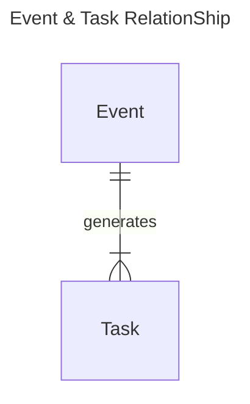
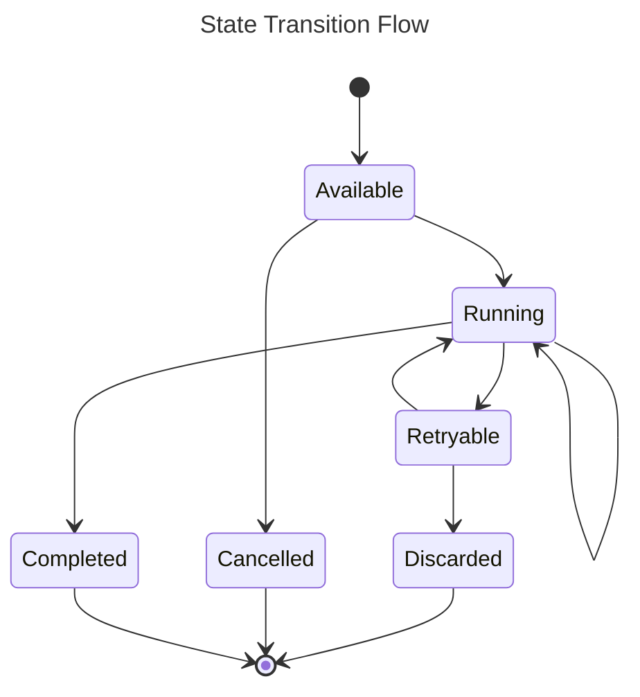
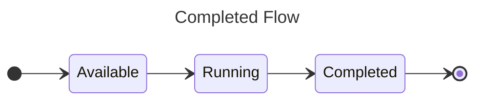
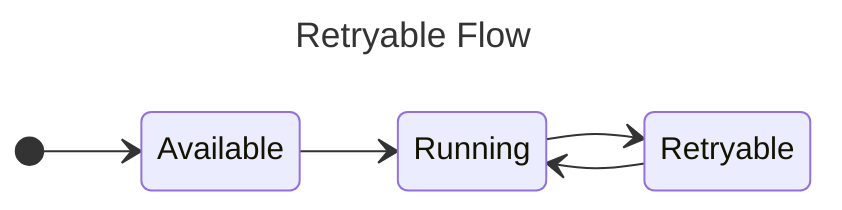
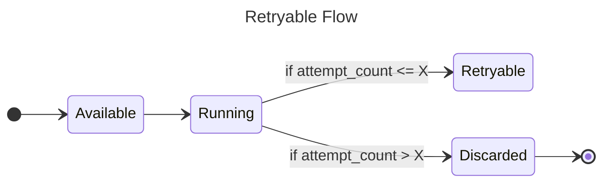
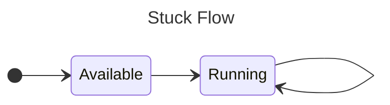

import Tabs from '@theme/Tabs';
import TabItem from '@theme/TabItem';

If `Event` is DTO of client and KanthorQ publisher, `Task` is DTO of KanthorQ subscriber and client handler.

So what is relationship between `Event` and `Task`? It's one to many relationship. One event can generate as many tasks as we want but one task can only be referenced to one event



There is the definition of the `Task` in different places in KanthorQ

<Tabs>
  <TabItem value="go" label="Go" default>
    ```go
    type Task struct {
      EventId      string `json:"event_id" validate:"required"`
      Subject      string `json:"subject" validate:"required,is_subject"`
      State        int16  `json:"state"`
      ScheduleAt   int64  `json:"schedule_at"`
      AttemptCount int16  `json:"attempt_count"`
      AttemptedAt  int64  `json:"attempted_at"`
      FinalizedAt  int64  `json:"finalized_at"`
      CreatedAt    int64  `json:"created_at"`
      UpdatedAt    int64  `json:"updated_at"`
    }
    ```
  </TabItem>
  <TabItem value="postgresql" label="PostgreSQL">
    ```sql
    TABLE kanthorq_consumer_send_confirmed_email (
      event_id VARCHAR(64) NOT NULL,
      subject VARCHAR(256) NOT NULL,
      state SMALLINT NOT NULL DEFAULT 1,
      schedule_at BIGINT NOT NULL DEFAULT EXTRACT(EPOCH FROM CURRENT_TIMESTAMP) * 1000,
      finalized_at BIGINT NOT NULL DEFAULT 0,
      attempt_count SMALLINT NOT NULL DEFAULT 0,
      attempted_at BIGINT NOT NULL DEFAULT 0,
      created_at BIGINT NOT NULL DEFAULT EXTRACT(EPOCH FROM CURRENT_TIMESTAMP) * 1000,
      updated_at BIGINT NOT NULL DEFAULT EXTRACT(EPOCH FROM CURRENT_TIMESTAMP) * 1000
    )
    ```
  </TabItem>
</Tabs>

- `schedule_at` is the time that a task will not be processed before that time. That mean if you schedule a task at _10:00AM_, that task can be processed at any time after _10:00AM_: _10:01AM_ or _11:15AM_ or _02:00PM_ for example
- `finalized_at` is the KanthorQ finally done with that task. No more action will be performed on a task after that time. If you want to do something with a task after that time, retry `Discarded` for example, you need to do it manually
- `attempt_count` is how many time we have retried a task.
- `attempted_at` is the latest attempt we have made for a task

### Task State

There are 6 states a task can have:

- `Available`: is the state for tasks that are immediately eligible to be worked.
- `Discarded`: is the state for tasks that have errored enough times that they're no longer eligible to be retried. Manual user invention is required for them to be tried again.
- `Cancelled`: is the state for tasks that have been manually cancelled by user request.
- `Completed` is the state for tasks that have successfully run to completion.
- `Running`: is the state for tasks that are actively running.
- `Retryable` is the state for tasks that have errored, but will be retried.

We can categorize them into three groups

- **Initial States**: The beginning state of a task before picking up to process. Currently we only have one state for this group: `Available`

- **Transitional States**: Tasks will stay at this state for awhile before to be transformed to another state (which maybe as same as the current state based on the business logic). We have `Running` and `Retryable` now.

- **Final States**: Once the task is moved into this state, it will stay at that state until user manually handle it. We have totally three state: `Discarded`, `Cancelled` and `Completed`



#### Completed Flow

This is the most expected flow we want to see in the system. Nothing to say about it, lets check the diagram to see the flow



#### Cancelled Flow

There are two direction to drive an event to `Cancelled` state.

- Event is cancelled by user directly using system API after the task is initialized.

  ```mermaid
  ---
  title: Cancelled by user
  ---
  stateDiagram-v2
      direction LR
      [*] --> Available
      Available --> Cancelled
      Cancelled --> [*]
  ```

- Event is cancelled after running by a program/worker/handler and the program/worker/handler decides to tell KanthorQ system should cancel that task.

  ```mermaid
  ---
  title: Cancelled by user
  ---
  stateDiagram-v2
      direction LR
      [*] --> Available
      Available --> Running
      Running --> Cancelled
      Cancelled --> [*]
  ```

#### Retryable & Discarded Flow

Once the program/worker/handler return an error after processing the event, we will put the state into a state name `Retryable`. Another process need setting up to pick up those events to move them back to `Running` state before processing it again



But if the event countinuely return an error after configurable times, we should put that event to the `Discarded` state. Once event is in `Discarded` state, user need to investigate on those events by themself to figure out what wrong was happen. They they can move it back to `Available` so they can be processed again



#### Stuck Flow

Stuck Flow is designed to handle unexpected behavious when a program/worker/handler picks a task then does not report whether the event is processed successfully or not. It happens when the program/worker/handler is crashed because of various issues around the system.



:::danger

Currently a stuck task will be process forever until it is moved to `Retryable` or `Discarded`. That decision was made because we belived the crashed issue should not be happened persistently. After a fix, all stuck events should be processed normally and no action need taking.

:::
