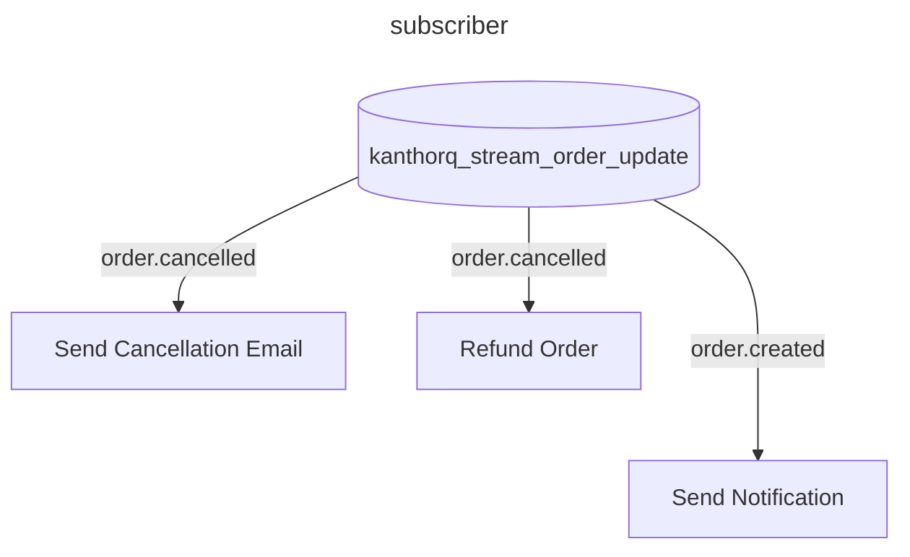
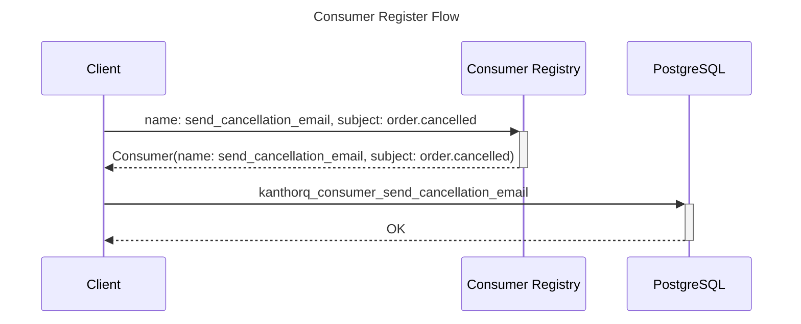
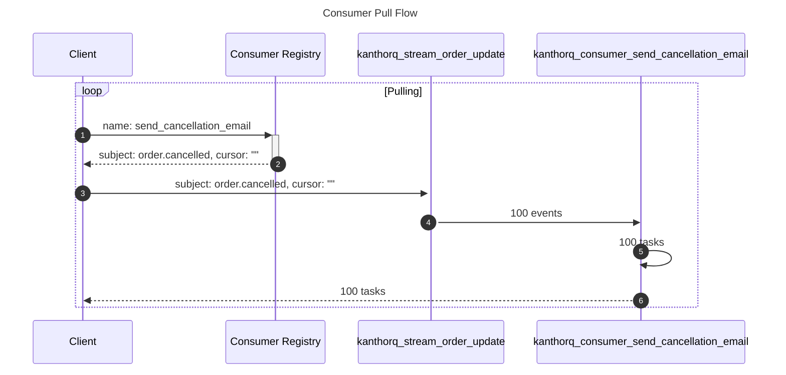

import Tabs from '@theme/Tabs';
import TabItem from '@theme/TabItem';

Consumer is a subject specific filter of events from a stream what stores metadata about how we want to process those events. One consumer can only subscribe to one subject but we can have more than one consumer for only one subject.

For example, with the subject `order.cancelled` we may want to spin up two consumer: one for sending notification via email to user to nofiy user that their order is confirmed and another consumer to handle logic of showing that order in a CRM so seller can prepare to ship that order



## Manage consumers

Like stream, when you create or register a consumer, its information will be store in a registry before KanthorQ creates an acutal consumer to store tasks to process later



### Consumer Registry

There is the definition of the `Consumer Registry` in different places in KanthorQ

<Tabs>
  <TabItem value="go" label="Go" default>
    ```go
    type ConsumerRegistry struct {
        StreamName string `json:"stream_name"`
        Name       string `json:"name"`
        Subject      string `json:"subject"`
        Cursor     string `json:"cursor"`
        AttemptMax int16  `json:"attempt_max"`
        CreatedAt  int64  `json:"created_at"`
        UpdatedAt  int64  `json:"updated_at"`
    }
    ```
  </TabItem>
  <TabItem value="postgresql" label="PostgreSQL">
    ```sql
    TABLE kanthorq_consumer_registry (
        name VARCHAR(128) NOT NULL,
        stream_name VARCHAR(128) NOT NULL,
        subject VARCHAR(128) NOT NULL,
        cursor VARCHAR(64) NOT NULL,
        attempt_max SMALLINT NOT NULL DEFAULT 3,
        created_at BIGINT NOT NULL DEFAULT EXTRACT(EPOCH FROM CURRENT_TIMESTAMP) * 1000,
        updated_at BIGINT NOT NULL DEFAULT EXTRACT(EPOCH FROM CURRENT_TIMESTAMP) * 1000,
        PRIMARY KEY (name)
    )
    ```
  </TabItem>
</Tabs>

Not like stream, consumer registry contains some runtime configuration that control how a consumer should handle their tasks.

- `cursor`: When a consumer is registred, it will be empty. But after any execution, `cursor` is the `id` property of the latest event we can pull out of stream with `subject` filter. For example, after the first execution with subject `order.created`, the latest id we can retrieve is `id_10`, next execution will always take the filter that `id > id_10` as the condition to filter our already processed events or tasks

- `attempt_max` control how many attempt we want to do before give up on error tasks.

### Consumer

A consumer itself store a group of tasks that are generated from events in a stream. If your stream `kanthorq_stream_order_update` has 999 events of subject `order.cancelled` and you have a consumer `kanthorq_consumer_registry` that subscribed to the event, you will have 999 tasks inside the consumer names `kanthorq_consumer_send_cancellation_email`

So when you want to get a list of tasks for your subscriber, you need to perform two action

- Generate a list of tasks for your consumer for matching events of consumer subject
- Pull out what tasks you have generated before with its information



If definition of `Stream` is as same as `Event`, definition of `Consumer` is as same as `Task` because `Consumer` is where we store metadata of how we will execute an event, aka a task

```sql
TABLE kanthorq_consumer_send_cancellation_email (
	event_id VARCHAR(64) NOT NULL,
	subject VARCHAR(128) NOT NULL,
	state SMALLINT NOT NULL DEFAULT 1,
	schedule_at BIGINT NOT NULL DEFAULT EXTRACT(EPOCH FROM CURRENT_TIMESTAMP) * 1000,
	finalized_at BIGINT NOT NULL DEFAULT 0,
	attempt_count SMALLINT NOT NULL DEFAULT 0,
	attempted_at BIGINT NOT NULL DEFAULT 0,
	created_at BIGINT NOT NULL DEFAULT EXTRACT(EPOCH FROM CURRENT_TIMESTAMP) * 1000,
	updated_at BIGINT NOT NULL DEFAULT EXTRACT(EPOCH FROM CURRENT_TIMESTAMP) * 1000,
	PRIMARY KEY (event_id)
)
```
