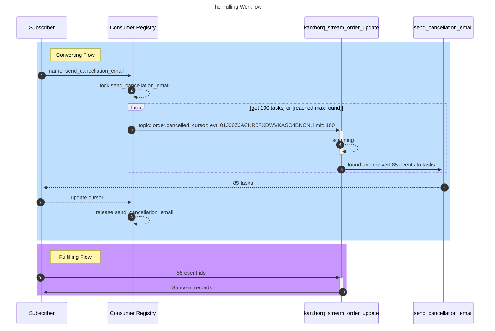
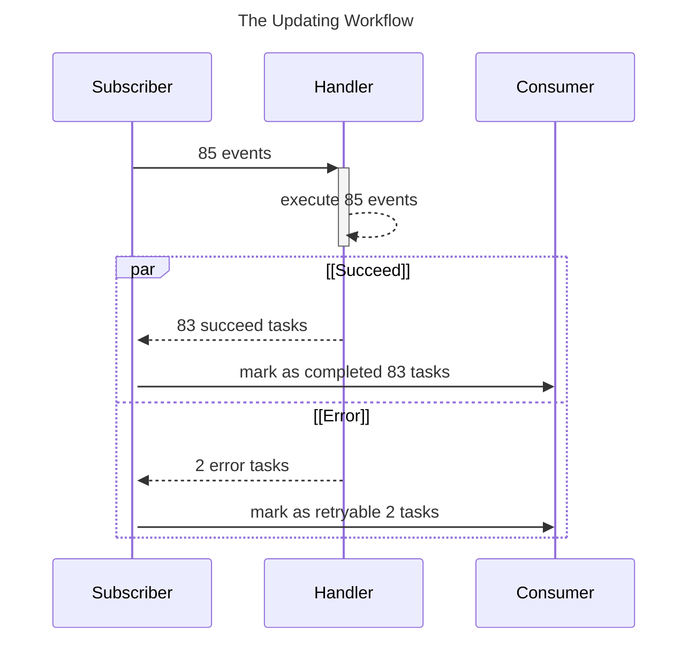

The Subscriber is the most complicated component in KanthorQ system, but that complexity serves only one purpose: get your a task to work on it then try to get your task moves to **Final State**. If something went wrong with your task, you can ask for retry both manually or automatically from the Subscriber.

## Workflows

The Subscriber workflows will contains two parts: the pulling workflow that help you get tasks for your works and the updating workflow that help you update your tasks state after you have done with them

### The Pulling Workflow



The Pulling flow contains two child workflow: the Converting flow that help you scans events from a stream with given topic then convert to tasks on a stream and the Fulfilling flow that get event records based on the list of converted tasks of the Converting flow.

#### The Converting Flow

1. We connect to the Consumer Registry to start our flow.
2. We ask Consumer Registry to lock the record of requesting consumer
3. Then use properties of the consumer: a stream name, a topic and a cursor of previous scanning in the stream to make a request to the stream.
4. Perform the scaning process on the given stream based on the given topic and cursor to obtain enough events
5. Convert founding events to tasks
6. Return tasks to the Subscriber
7. Update the Consumer Registry with latest cursor (the latest `event_id` of tasks)
8. Release the lock of the Consumer

:::info

By saying **scanning**, we mean we will query events from a stream from the lower bound that is specify by the **cursor** until we get enough rows (100 events). The simplify query will look like

```sql
SELECT * FROM kanthorq_stream_order_update WHERE topic = 'order.cancelled' AND id > 'evt_01J36ZJACKR5FXDWVKASC4BNCN' LIMIT 100
```

:::

#### The Fulfilling Flow

9. We get event records based on the list of tasks we have received (task contains `event_id`)
10. We receive event records then perform our handler execution logic.

### The Updating Workflow

After finished your works, you need to report back to the Subscriber what state of a task should be updated to. For example, there are two main states you want the Subscriber to update: `Completed` and `Retryable` for succeed task and error task respectively. But there are some situation you don't want to let error task to be retried, so you want to mark that task as `Cancelled`

:::tip

Checkout our definition about [Task State](./005-task.md#task-state) to see how many state do we have and what categories they are.

:::



:::danger

If you plan to update the state by yourself (common, it's just a PostgreSQL query and you can totally do it by yourslef), make sure you keep in mind that you should only move a task from state-A to state-B, not override the task to state B

Example:

```
# no supprise, if task does not in state-A, nothing will be updated
task:state-A -> task:state-B

# if concurrency updating happen at the same time, [Lost Update](https://en.wikipedia.org/wiki/Concurrency_control) will happen
task -> task:state-B

# three updates bellow are executed at the same time, then you will lost update of two tasks and does not know about it to rollback if it's necessary
task:state-A -> task:state-B
task:state-X -> task:state-B
task:state-Y -> task:state-B
```

:::
