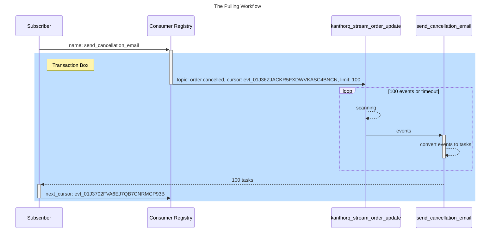
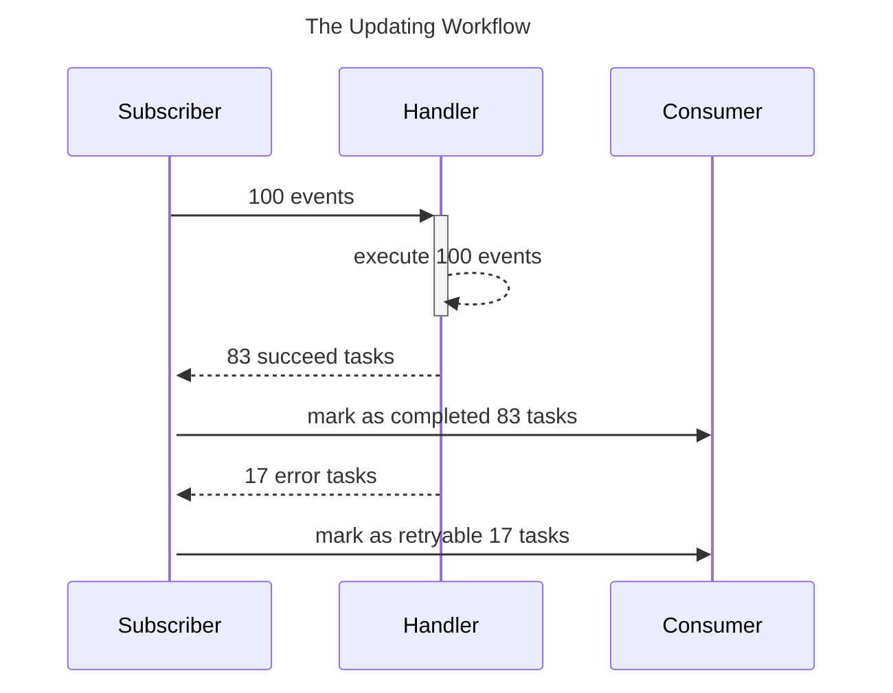

The Subscriber is the most complicated component in KanthorQ system, but that complexity serves only one purpose: get your a task to work on it then try to get your task moves to **Final State**. If something went wrong with your task, you can ask for retry both manually or automatically from the Subscriber.

## Workflows

The Subscriber workflows will contains two parts: the pulling workflow that help you get tasks for your works and the updating workflow that help you update your task state after you have done with it

### The Pulling Workflow



Not like Publish only works with one component - the Stream, the Subscriber needs to interact with two components: the Stream and the Consumer. It will work with the Stream to help convert events from a stream to a task in a consumer, then it pulls those tasks for you. The _Transaction Box_ indicates that all actions will be run in a transcation, so that we can guarantee pulling a task exactly once.

1. We will start with a request to ask for 100 tasks.
2. We need to work with the Consumer Registry to get a stream name, a topic and a cursor of previous scanning in the Stream. If the scan does not receive enough events, we need to perform it again until we reach maximum waiting time of the scan.
3. Put all parameters together we will scan the Stream to look for matching events with given topic.
4. After events are found, we start converting those events to tasks by inserting them into our Consumer then return those tasks back to our Subscriber.
5. Because a task is belong to only one event, so we also know what is the next cursor is (the latest task contains the latest matching event), so we need to update that cursor back to our Consumer Registry
6. Countinue the loop until we get termination sinal

:::info

By saying **scanning**, we mean we will query events from a stream from the lower bound that is specify by the **cursor** until we get enough rows (100 events). The simplify query will look like

```sql
SELECT * FROM kanthorq_stream_order_update WHERE id > 'evt_01J36ZJACKR5FXDWVKASC4BNCN' LIMIT 100
```

:::

### The Updating Workflow

After finished your works, you need to report back to the Subscriber what state of a task should be updated to. For example, there are two main states you want the Subscriber to update: `Completed` and `Retryable` for succeed task and error task respectively. But there are some situation you don't want to let error task to be retried, so you want to mark that task as `Cancelled`

:::tip

Checkout our definition about [Task State](./005-task.md#task-state) to see how many state do we have and what categories they are.

:::



:::danger

If you plan to update the state by yourself (common, it's just a PostgreSQL query and you can totally do it by yourslef), make sure you keep in mind that you should only move a task from state-A to state-B, not override the task to state B

Example:

```
# no supprise, if task does not in state-A, nothing will be updated
task:state-A -> task:state-B

# if concurrency updating happen at the same time, [Lost Update](https://en.wikipedia.org/wiki/Concurrency_control) will happen
task -> task:state-B

# three updates bellow are executed at the same time, then you will lost update of two tasks and does not know about it to rollback if it's necessary
task:state-A -> task:state-B
task:state-X -> task:state-B
task:state-Y -> task:state-B
```

:::
