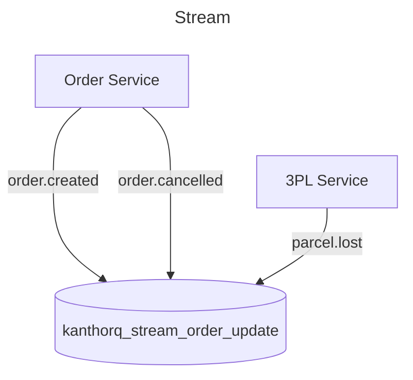
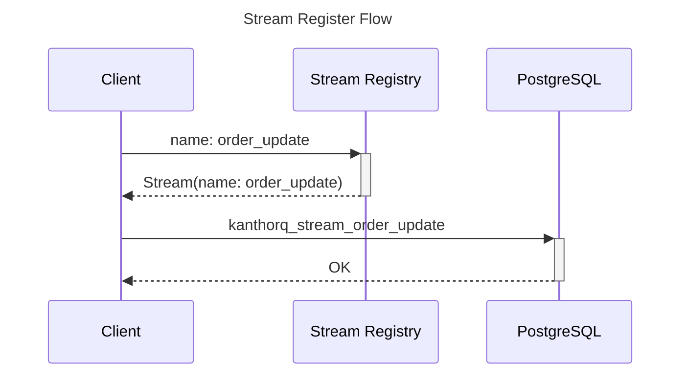

import Tabs from '@theme/Tabs';
import TabItem from '@theme/TabItem';

A Stream in KanthorQ is a persistent, append-only event group designed to serve specific purposes. For instance, you can create a stream named `order_update` to store all events related to orders within that stream.



Key Characteristics of a Stream:

- Events remain in the stream indefinitely until you explicitly remove them or delete the stream (which also requires explicit confirmation).
- Multiple processes (called Consumers) can read and process events from a stream, but the event data itself remains unchanged in the stream.
- Events within a stream should only be paginated based on the order of `event.id` or a combination of (`event.subject`, `event.id`).

## Manage streams

When you create or register a stream for use, its details are stored in a registry. KanthorQ then creates the actual stream where events can be stored, based on the information returned from the registry.



### Stream Registry

<Tabs>
  <TabItem value="go" label="Go" default>
    ```go
    type StreamRegistry struct {
      Id        string `json:"id" validate:"required"`
      Name      string `json:"name" validate:"required,is_collection_name"`
      CreatedAt int64  `json:"created_at"`
      UpdatedAt int64  `json:"updated_at"`
    }
    ```
  </TabItem>
  <TabItem value="postgresql" label="PostgreSQL">
    ```sql
    TABLE kanthorq_stream_registry (
      id VARCHAR(64) NOT NULL,
      name VARCHAR(256) NOT NULL,
      created_at BIGINT NOT NULL DEFAULT EXTRACT(EPOCH FROM CURRENT_TIMESTAMP) * 1000,
      updated_at BIGINT NOT NULL DEFAULT EXTRACT(EPOCH FROM CURRENT_TIMESTAMP) * 1000,
      PRIMARY KEY (id)
    );
    ```
  </TabItem>
</Tabs>

### Stream

As described, a Stream is simply an **append-only event group**. Therefore, its structure mirrors the shape of the Event.

```sql
TABLE kanthorq_stream_order_update (
  id VARCHAR(64) NOT NULL,
  subject VARCHAR(256) NOT NULL,
  body BYTEA NOT NULL,
  metadata JSONB NOT NULL DEFAULT '{}',
  created_at BIGINT NOT NULL DEFAULT EXTRACT(EPOCH FROM CURRENT_TIMESTAMP) * 1000,
  PRIMARY KEY (id)
)
```
