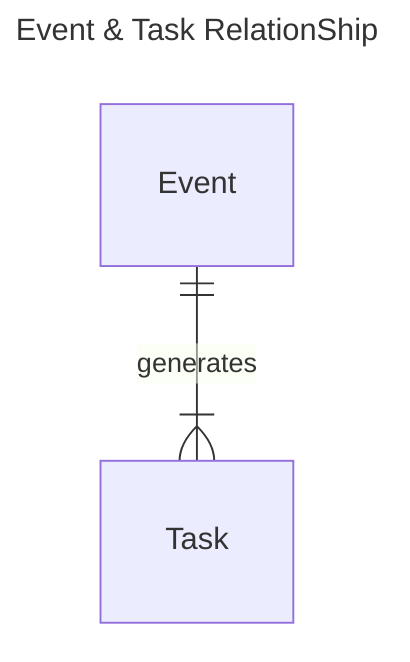
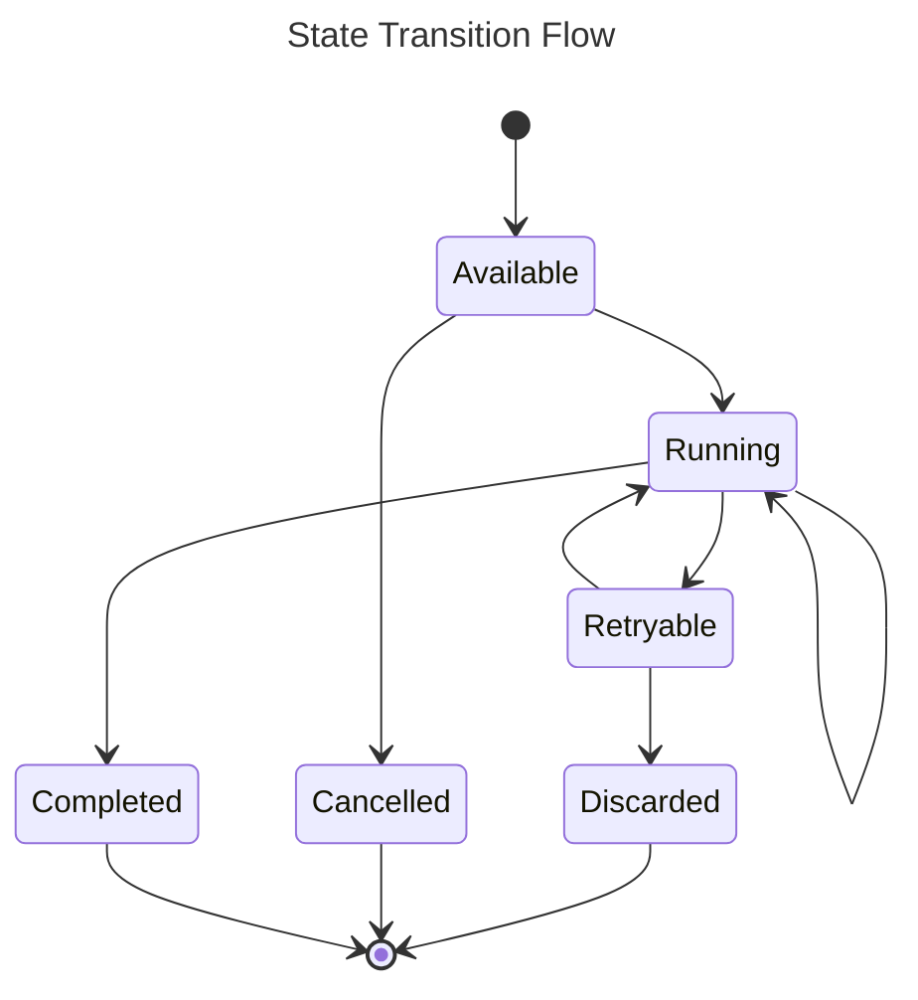
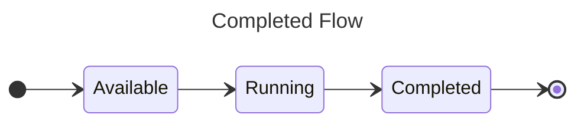
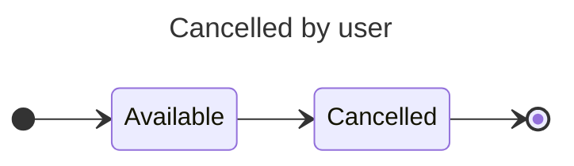
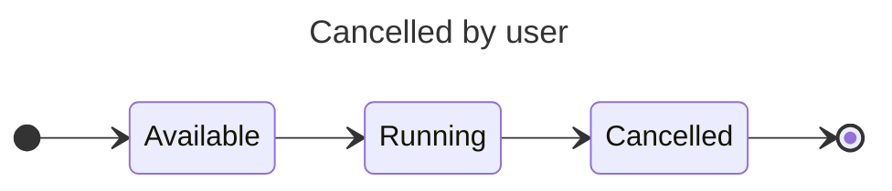
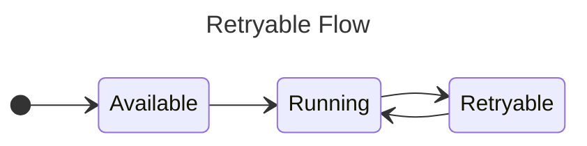
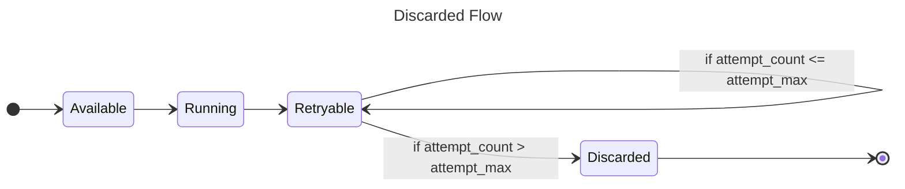
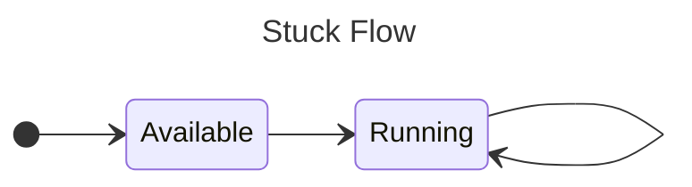

import Tabs from '@theme/Tabs';
import TabItem from '@theme/TabItem';

If an `Event` is the DTO for client-to-KanthorQ publisher communication, then a `Task` is the DTO for KanthorQ subscriber-to-client handler communication.

So, what is the relationship between an Event and a Task? It’s a one-to-many relationship: one event can generate multiple tasks, but each task references only one event.



Lets review about the structure of `Task`:

<Tabs>
  <TabItem value="go" label="Go" default>
    ```go
    type Task struct {
      EventId      string `json:"event_id" validate:"required"`
      Subject      string `json:"subject" validate:"required,is_subject"`
      State        int16  `json:"state"`
      ScheduleAt   int64  `json:"schedule_at"`
      AttemptCount int16  `json:"attempt_count"`
      AttemptedAt  int64  `json:"attempted_at"`
      FinalizedAt  int64  `json:"finalized_at"`
      CreatedAt    int64  `json:"created_at"`
      UpdatedAt    int64  `json:"updated_at"`
    }
    ```
  </TabItem>
  <TabItem value="postgresql" label="PostgreSQL">
    ```sql
    TABLE kanthorq_consumer_send_confirmed_email (
      event_id VARCHAR(64) NOT NULL,
      subject VARCHAR(256) NOT NULL,
      state SMALLINT NOT NULL DEFAULT 1,
      schedule_at BIGINT NOT NULL DEFAULT EXTRACT(EPOCH FROM CURRENT_TIMESTAMP) * 1000,
      finalized_at BIGINT NOT NULL DEFAULT 0,
      attempt_count SMALLINT NOT NULL DEFAULT 0,
      attempted_at BIGINT NOT NULL DEFAULT 0,
      created_at BIGINT NOT NULL DEFAULT EXTRACT(EPOCH FROM CURRENT_TIMESTAMP) * 1000,
      updated_at BIGINT NOT NULL DEFAULT EXTRACT(EPOCH FROM CURRENT_TIMESTAMP) * 1000
    )
    ```
  </TabItem>
</Tabs>

- `event_id` and `subject` are properties that we copy from an `Event`
- `state` is the state of a task, indicates the status of a task.
- `schedule_at` is the time when a task becomes eligible for processing. For example, if you schedule a task at _10:00 AM_, it can be processed at any point after that—such as at _10:01 AM_, _11:15 AM_, or even _2:00 PM_.
- `finalized_at` is the time when KanthorQ has finished processing a task. No further action will be performed on the task after this time. If you want to take further actions, such as retrying a `Discarded` task, you must do it manually by calling an API.
- `attempt_count` is the number of times a task has been retried.
- `attempted_at` is the timestamp of the latest retry attempt.

### Task State

There are six possible states for a task:

- `Available`: The task is ready to be processed.
- `Discarded`: The task has failed too many times and is no longer eligible for retries. Manual intervention is required to retry it.
- `Cancelled`: The task has been manually canceled by the user.
- `Completed`: The task has successfully run to completion.
- `Running`: The task is currently being processed.
- `Retryable`: The task has failed but is eligible to be retried.

We can categorize states of tasks into three groups

- **Initial States**: These are the starting states before a task is processed. Currently, there is only one: `Available`.
- **Transitional States**: These states indicate that a task is in progress or being retried. The `Running` and `Retryable` states fall under this category.
- **Final States**: Once a task reaches one of these states, it remains there until manual action is taken. These states include `Discarded`, `Cancelled`, and `Completed`.



#### Completed Flow

This is the most desirable flow, where tasks successfully complete without any issues. See the diagram below for the flow:



#### Cancelled Flow

There are two paths that can lead a task to the `Cancelled` state:

1. The event is directly canceled by the user through the system API after the task is initialized.



2. The event is canceled while running by a program/worker/handler, which then notifies the KanthorQ system to cancel the task.



#### Retryable & Discarded Flow

When a program/worker/handler encounters an error while processing an event, the task transitions to the `Retryable` state. A separate process must pick up the task and move it back to the `Running` state to retry processing.



If the task continues to fail after a configurable number of retries, it transitions to the `Discarded` state. Once in the `Discarded` state, the user must manually investigate and decide whether to move the task back to `Available` for reprocessing.



#### Stuck Flow

The **Stuck Flow** handles situations where a program/worker/handler starts processing a task but doesn’t report the result due to a crash or other unexpected issue.



Tasks that are stuck in the `Running` state will be retried automatically after a configurable period known as the **Visibility Timeout**. This means that a designated period is reserved for you to complete the task. If the task remains unprocessed after this period, we will attempt to pick it up and process it again.

:::danger

The **Stuck Flow** poses a risk of duplicated execution. It’s crucial to plan your `Subscriber`s carefully to ensure that your logic can be completed in a timely manner. Otherwise, another process may pick up the task and execute it again, leading to potential duplication.

:::
