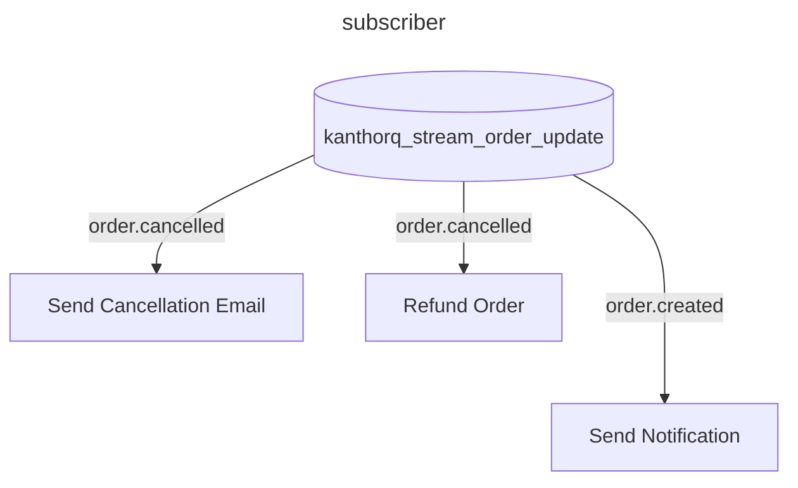
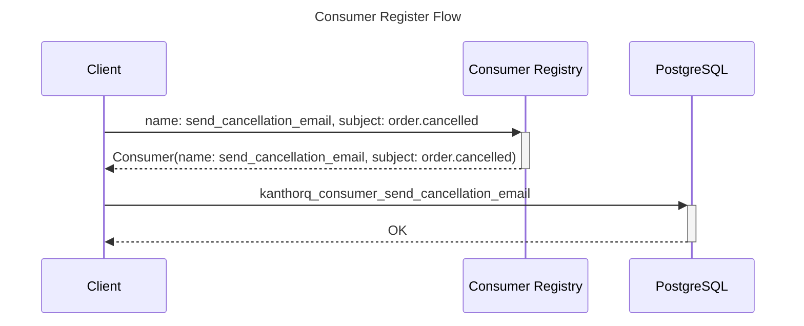
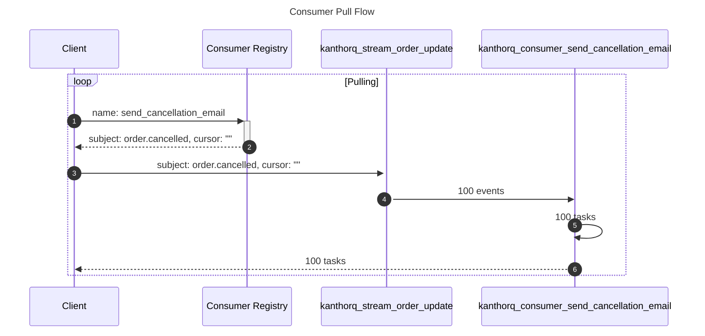

import Tabs from '@theme/Tabs';
import TabItem from '@theme/TabItem';

Consumer is a subject-specific filter for events from a stream, storing metadata about how those events should be processed. A single consumer can only subscribe to one subject, but you can have multiple consumers for a single subject.

For example, with the subject `order.cancelled`, you might want to create two consumers: one to send a notification email to the user, notifying them of the order cancellation, and another to handle CRM logic for refund processing.



## Manage consumers

Similar to streams, when you create or register a consumer, its information is stored in a registry before KanthorQ creates the actual consumer, which stores tasks for future processing.



### Consumer Registry

The **Consumer Registry** stores important runtime configurations that control how the consumer should handle tasks. Here’s an example definition of a consumer in KanthorQ:

<Tabs>
  <TabItem value="go" label="Go" default>
    ```go
    type ConsumerRegistry struct {
      StreamId          string   `json:"stream_id" validate:"required"`
      StreamName        string   `json:"stream_name" validate:"required,is_collection_name"`
      Id                string   `json:"id" validate:"required"`
      Name              string   `json:"name" validate:"required,is_collection_name"`
      SubjectIncludes   []string `json:"subject_includes" validate:"required,gt=0,dive,is_subject_filter"`
      SubjectExcludes   []string `json:"subject_excludes" validate:"gte=0,dive,is_subject_filter"`
      Cursor            string   `json:"cursor"`
      AttemptMax        int16    `json:"attempt_max"`
      VisibilityTimeout int64    `json:"visibility_timeout" validate:"required,gt=1000"`
      CreatedAt         int64    `json:"created_at"`
      UpdatedAt         int64    `json:"updated_at"`
    }
    ```
  </TabItem>
  <TabItem value="postgresql" label="PostgreSQL">
    ```sql
    TABLE kanthorq_consumer_registry (
      stream_id VARCHAR(64) NOT NULL,
      stream_name VARCHAR(256) NOT NULL,
      id VARCHAR(64) NOT NULL,
      name VARCHAR(256) NOT NULL,
      subject_includes VARCHAR(256) ARRAY NOT NULL,
      subject_excludes VARCHAR(256) ARRAY NOT NULL DEFAULT '{}',
      cursor VARCHAR(64) NOT NULL,
      attempt_max SMALLINT NOT NULL DEFAULT 16,
      visibility_timeout BIGINT NOT NULL DEFAULT 300000,
      created_at BIGINT NOT NULL DEFAULT EXTRACT(EPOCH FROM CURRENT_TIMESTAMP) * 1000,
      updated_at BIGINT NOT NULL DEFAULT EXTRACT(EPOCH FROM CURRENT_TIMESTAMP) * 1000,
      PRIMARY KEY (name)
    )
    ```
  </TabItem>
</Tabs>

**Key Runtime Configurations**

- `cursor`: Initially empty, the cursor stores the id of the most recent event processed by a consumer. For example, after processing an event with the subject `order.created` (e.g., event id_10), the next execution will filter for events where `id > id_10`.
- `attempt_max`: Defines the maximum number of retry attempts for error-prone tasks. After that number, the task will be mark as `Discarded`.

### Consumer

A Consumer stores a group of tasks generated from events in a stream. For instance, if your stream `kanthorq_stream_order_update` has 999 events with the subject `order.cancelled` and a consumer subscribed to it, the consumer `kanthorq_consumer_send_cancellation_email` will store 999 tasks.

To retrieve tasks for your subscriber, you need to:

- Generate a list of tasks for your consumer based on matching events.
- Pull previously generated tasks with their metadata.



If a `Stream` is defined similarly to an `Event`, a `Consumer` is defined similarly to a `Task`, as it stores metadata about how to execute an event (i.e., a task).

```sql
TABLE kanthorq_consumer_send_cancellation_email (
	event_id VARCHAR(64) NOT NULL,
	subject VARCHAR(256) NOT NULL,
	state SMALLINT NOT NULL DEFAULT 1,
	schedule_at BIGINT NOT NULL DEFAULT EXTRACT(EPOCH FROM CURRENT_TIMESTAMP) * 1000,
	finalized_at BIGINT NOT NULL DEFAULT 0,
	attempt_count SMALLINT NOT NULL DEFAULT 0,
	attempted_at BIGINT NOT NULL DEFAULT 0,
	created_at BIGINT NOT NULL DEFAULT EXTRACT(EPOCH FROM CURRENT_TIMESTAMP) * 1000,
	updated_at BIGINT NOT NULL DEFAULT EXTRACT(EPOCH FROM CURRENT_TIMESTAMP) * 1000,
	PRIMARY KEY (event_id)
)
```
