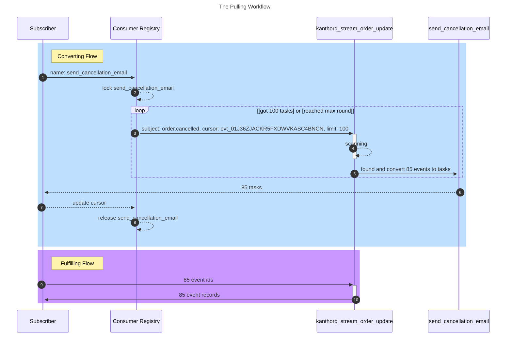
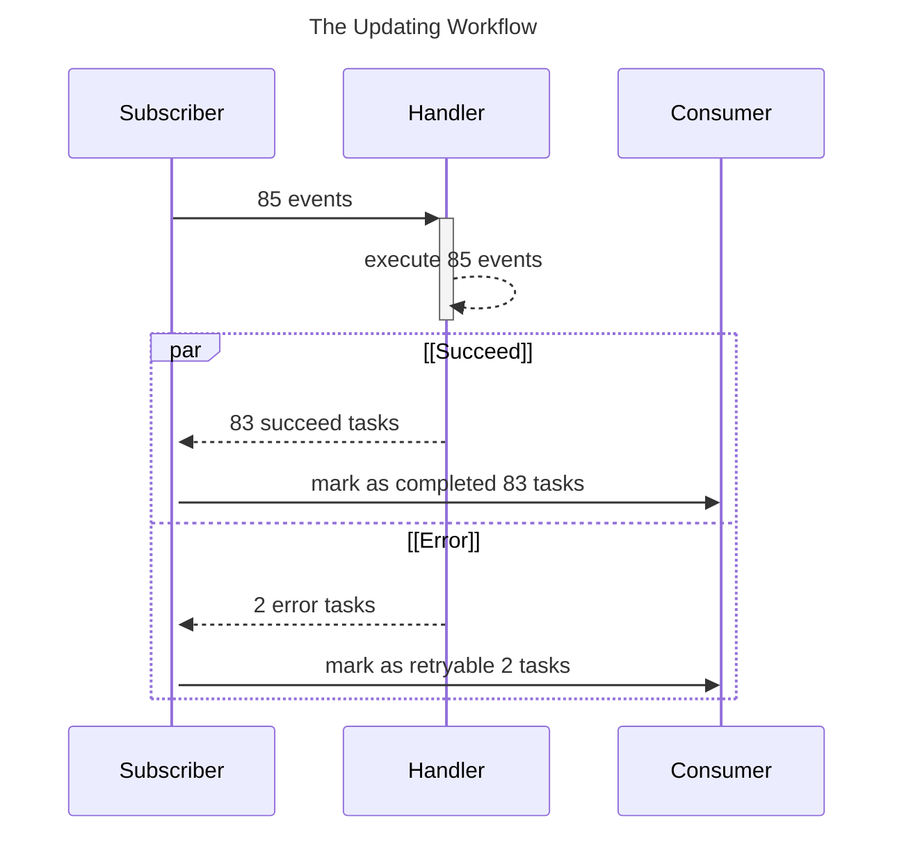

The **Subscriber** is the most complex component in the KanthorQ system, but its purpose is simple: it pulls tasks, processes them, and moves them to their next state. If something goes wrong with a task, the **Subscriber** allows you to retry it, either manually or automatically.

## Workflows

The **Subscriber** workflow consists of two main parts:

- **Pulling Workflow**: Retrieves tasks for processing.
- **Updating Workflow**: Updates the task’s state after processing.

### The Pulling Workflow



The **Pulling Workflow** contains two sub-workflows:

- **Converting Flow**: Scans events from a stream based on a subject and converts them to tasks.
- **Fulfilling Flow**: Retrieves event records based on the converted tasks and performs the necessary execution logic.

#### The Converting Flow

- The **Subscriber** connects to the **Consumer Registry** to initiate the flow.
- It locks the consumer record (e.g., send_cancellation_email) to prevent concurrent executions.
- Using the consumer’s properties (stream name, subject, and cursor), the **Subscriber** requests the stream for events.
- It scans the stream for events matching the subject and cursor until it gathers enough events (configurable, default is 100).
- The found events are converted into tasks and returned to the **Subscriber**.
- The cursor is updated with the latest event ID, and the consumer lock is released.

:::info

When we say **scanning**, we mean querying events from the stream using a lower bound specified by the cursor until the required number of events (e.g., 100) is retrieved. A simplified query might look like this:

```sql
SELECT * FROM kanthorq_stream_order_update WHERE subject = 'order.cancelled' AND id > 'evt_01J36ZJACKR5FXDWVKASC4BNCN' LIMIT 100
```

:::

#### The Fulfilling Flow

- Retrieve event records based on the list of tasks received (each task contains an `event_id`).
- Execute handler logic for each event record.

### The Updating Workflow

After processing tasks, you must report back to the **Subscriber** to update the task state. Typically, there are two main states to update:

- `Completed`: For successfully processed tasks.
- `Retryable`: For tasks that failed but can be retried.

There is one state to update is `Discarded`. It happens when a task fails too many times and is no longer eligible for retries.

In some cases, you may want to mark a task as `Cancelled` if it should not be retried after encountering an error.

:::tip

Refer to the [Task State](./006-task.md#task-state) documentation for a detailed breakdown of states and categories.

:::



:::danger

If you choose to update the task state manually (e.g., through a PostgreSQL query), ensure you transition the task from one state to another properly. Directly overwriting task states can lead to [Lost Update](https://en.wikipedia.org/wiki/Lost_update), which are difficult to detect and debug.

:::

#### Risk of Lost Update

Concurrent updates can lead to _Lost Updates_ if you do not plan it prorperly. KanthorQ by default can eliminate _Lost Updates_ in the following cases:

**Example**:

If the following three queries are executed simultaneously, only one update will succeed, but all queries will return a message indicating one row was modified. The final state of the task may not reflect the intended state, leading to inconsistent data:

```sql
UPDATE tasks SET state = 'B' WHERE event_id = 'evt_01J36ZJACKR5FXDWVKASC4BNCN';
UPDATE tasks SET state = 'C' WHERE event_id = 'evt_01J36ZJACKR5FXDWVKASC4BNCN';
UPDATE tasks SET state = 'D' WHERE event_id = 'evt_01J36ZJACKR5FXDWVKASC4BNCN';
```

To avoid _Lost Updates_, ensure that tasks are transitioned from one state to another only if they are currently in the expected state. This ensures that only one update will modify the row, and the other queries will return no rows modified.

**Correct Example:**

In this approach, each query attempts to update the task only if it is in the initial state A. As a result, only one query will succeed, while the others will report no rows modified.

```sql
UPDATE tasks SET state = 'B' WHERE event_id = 'evt_01J36ZJACKR5FXDWVKASC4BNCN' AND state = 'A';
UPDATE tasks SET state = 'C' WHERE event_id = 'evt_01J36ZJACKR5FXDWVKASC4BNCN' AND state = 'A';
UPDATE tasks SET state = 'D' WHERE event_id = 'evt_01J36ZJACKR5FXDWVKASC4BNCN' AND state = 'A';
```

By using this method, you prevent concurrent updates from overwriting each other and ensure that only valid state transitions occur.
