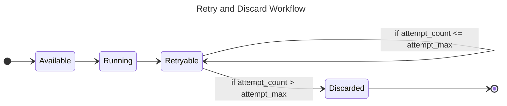

> Anything that can go wrong will go wrong - Murphy's law

When something went wrong at the [Default Workflow](./001-default-workflow.md), your tasks will be marked as `Retryable` first. We need another workflow to handle those `Retryable` tasks if you want to retry it.

The retry process will not be run forever, it will be limited by `attempt_max` option of the consumer which will be set when you initialize the subscriber.

