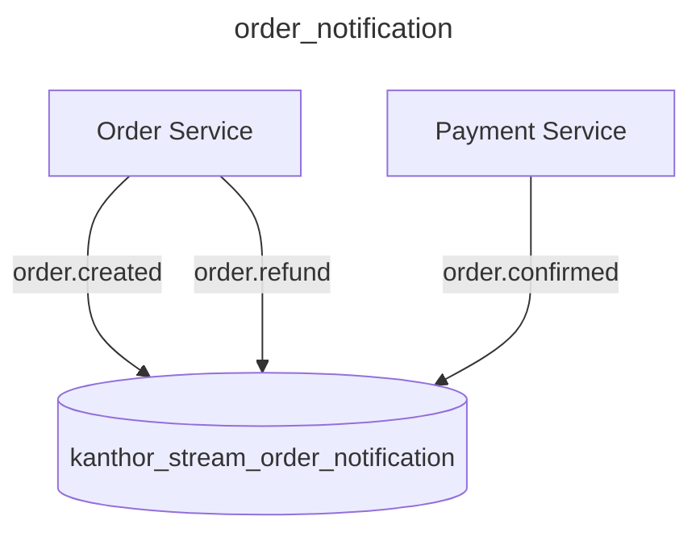
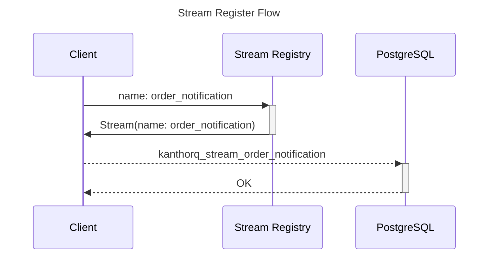

import Tabs from '@theme/Tabs';
import TabItem from '@theme/TabItem';

Stream is a persistent, append-only event group that serves specific purposes. For example, you can create a stream with name `order_notification` to put all events that are relates to your order into that stream.



There are some characteristics of a stream you should know

- An event stays forever in a stream until you explicitly remove it or a stream is deleted (also must be explicit confirmation)
- An event could be read and processed by multiple process (we call it `Consumer`) from the stream and nothing else the event data itself is stored in stream.
- Events in a stream could be only paginated by the order of `event.id` or the tuple of `(event.topic, event.id)`

## Manage streams

When you create or register a stream for you usage, its information will be store a registry then KanthorQ creates an acutal stream to store your events.



### Stream Registry

There is the definition of the `Stream Registry` in different places in KanthorQ

<Tabs>
  <TabItem value="go" label="Go" default>
    ```go
    type StreamRegistry struct {
      Name      string `json:"name"`
      CreatedAt int64  `json:"created_at"`
      UpdatedAt int64  `json:"updated_at"`
    }
    ```
  </TabItem>
  <TabItem value="postgresql" label="PostgreSQL">
    ```sql
    TABLE kanthorq_stream_registry (
      name VARCHAR(128) NOT NULL,
      created_at BIGINT NOT NULL DEFAULT EXTRACT(EPOCH FROM CURRENT_TIMESTAMP) * 1000,
      updated_at BIGINT NOT NULL DEFAULT EXTRACT(EPOCH FROM CURRENT_TIMESTAMP) * 1000,
      PRIMARY KEY (name)
    )
    ```
  </TabItem>
</Tabs>

### Stream

As the definition said about the `Stream`, it's just a **append-only event group** so its definition is just the definition of the `Event`.

```sql
TABLE kanthorq_stream_order_notification (
  id VARCHAR(64) NOT NULL,
  topic VARCHAR(128) NOT NULL,
  body BYTEA NOT NULL,
  metadata jsonb NOT NULL,
  created_at BIGINT NOT NULL DEFAULT EXTRACT(EPOCH FROM CURRENT_TIMESTAMP) * 1000,
  PRIMARY KEY (id)
)
```
