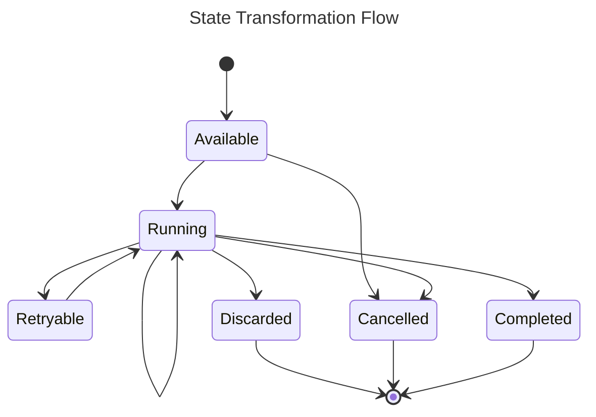

Consumer is topic specific filter from a stream what store metadata about how an event in a stream is processed. With each event a consumer subscribes to, we spin up an consumer job for it an track what we did and what we will do with that event of the job

## Job State

There are 6 states a job can have:

- `Available`: is the state for jobs that are immediately eligible to be worked.
- `Discarded`: is the state for jobs that have errored enough times that they're no longer eligible to be retried. Manual user invention is required for them to be tried again.
- `Cancelled`: is the state for jobs that have been manually cancelled by user request.
- `Completed` is the state for jobs that have successfully run to completion.
- `Running`: is the state for jobs that are actively running.
- `Retryable` is the state for jobs that have errored, but will be retried.

We can categorize them into 2 groups

- **Initial State**: The beginning state of a job before picking up to process. Currently we only have one state for this group: `Available`

- **Transitional State**: Jobs will stay at this state for awhile before to be transformed to another state (which maybe as same as the current state based on the business logic). We have `Running` and `Retryable` now.

- **Final State**: Once the job is moved into this state, it will stay at that state forever and should not be changed anymore. We have totally three state: `Discarded`, `Cancelled` and `Completed`

