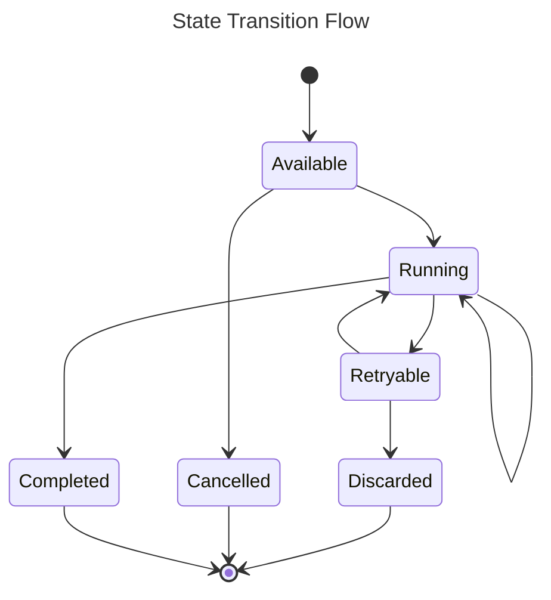
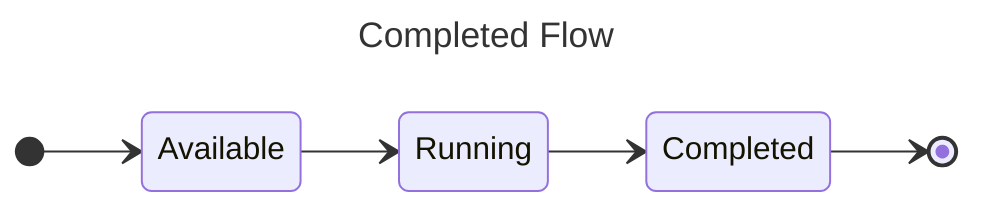
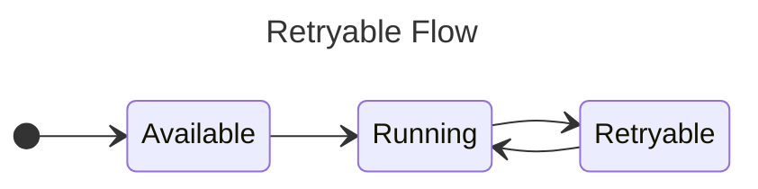
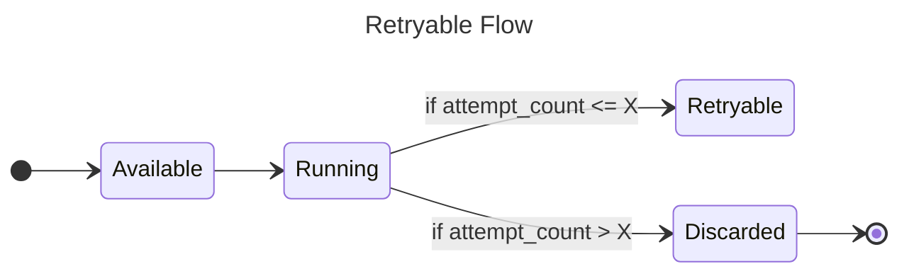
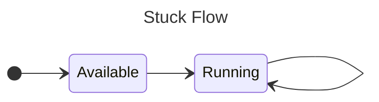

Consumer is topic specific filter from a stream what store metadata about how an event in a stream is processed. With each event a consumer subscribes to, we spin up an consumer job for it an track what we did and what we will do with that event of the job

## Job State

There are 6 states a job can have:

- `Available`: is the state for jobs that are immediately eligible to be worked.
- `Discarded`: is the state for jobs that have errored enough times that they're no longer eligible to be retried. Manual user invention is required for them to be tried again.
- `Cancelled`: is the state for jobs that have been manually cancelled by user request.
- `Completed` is the state for jobs that have successfully run to completion.
- `Running`: is the state for jobs that are actively running.
- `Retryable` is the state for jobs that have errored, but will be retried.

We can categorize them into three groups

- **Initial States**: The beginning state of a job before picking up to process. Currently we only have one state for this group: `Available`

- **Transitional States**: Jobs will stay at this state for awhile before to be transformed to another state (which maybe as same as the current state based on the business logic). We have `Running` and `Retryable` now.

- **Final States**: Once the job is moved into this state, it will stay at that state until user manually handle it. We have totally three state: `Discarded`, `Cancelled` and `Completed`



### Completed Flow

This is the most expected flow we want to see in the system. Nothing to say about it, lets check the diagram to see the flow



### Cancelled Flow

There are two direction to drive an event to `Cancelled` state.

- Event is cancelled by user directly using system API after the job is initialized.

  ```mermaid
  ---
  title: Cancelled by user
  ---
  stateDiagram-v2
      direction LR
      [*] --> Available
      Available --> Cancelled
      Cancelled --> [*]
  ```

- Event is cancelled after running by a program/worker/handler and the program/worker/handler decides to tell KanthorQ system should cancel that job.

  ```mermaid
  ---
  title: Cancelled by user
  ---
  stateDiagram-v2
      direction LR
      [*] --> Available
      Available --> Running
      Running --> Cancelled
      Cancelled --> [*]
  ```

### Retryable & Discarded Flow

Once the program/worker/handler return an error after processing the event, we will put the state into a state name `Retryable`. Another process need setting up to pick up those events to move them back to `Running` state before processing it again



But if the event countinuely return an error after configurable times, we should put that event to the `Discarded` state. Once event is in `Discarded` state, user need to investigate on those events by themself to figure out what wrong was happen. They they can move it back to `Available` so they can be processed again



### Stuck Flow

Stuck Flow is designed to handle unexpected behavious when a program/worker/handler picks a job then does not report whether the event is processed successfully or not. It happens when the program/worker/handler is crashed because of various issues around the system.



:::danger

Currently a stuck job will be process forever until it is moved to `Retryable` or `Discarded`. That decision was made because we belived the crashed issue should not be happened persistently. After a fix, all stuck events should be processed normally and no action need taking.

:::
